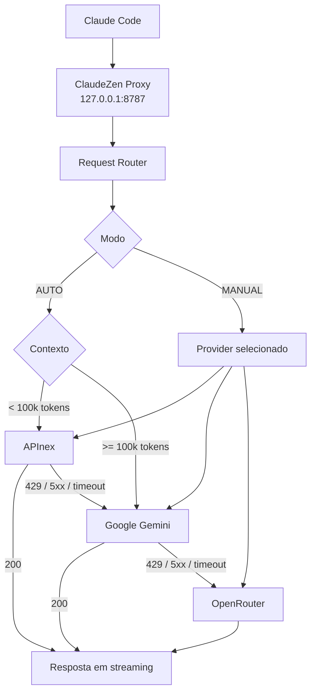

# ClaudeZen Hybrid Router

Proxy local para Claude Code com **roteamento híbrido entre múltiplos provedores de IA**, fallback automático, seleção manual de provider, cooldown, streaming em tempo real e **observabilidade por requisição** (estimativa local × uso real informado pelo provedor).

O Claude Code conversa somente com:

```text
http://127.0.0.1:8787
```

O ClaudeZen decide internamente qual provider e qual modelo serão utilizados.

> **Status do projeto: em desenvolvimento ativo.** A versão atual está operacional (AUTO, MANUAL, fallback, cooldown, streaming e observabilidade), mas ainda assume **um provider por plataforma**. Já foi identificado que a configuração precisa ser mais genérica para suportar **vários modelos da mesma plataforma** (por exemplo, dois modelos do OpenRouter como contingências independentes). Esses pontos estão em implementação e teste e estão detalhados na [seção 20 do relatório técnico](RELATORIO.md#20-pontos-a-melhorar-em-desenvolvimento).

---

## Arquitetura



---

# Características

* [x] Proxy local para Claude Code
* [x] Roteamento automático (AUTO) e manual (MANUAL)
* [x] APInex, Google Gemini e OpenRouter
* [x] Fallback automático em cadeia
* [x] Cooldown por provider
* [x] Timeout por provider
* [x] **Streaming em tempo real** (sem bufferizar a resposta)
* [x] **Cancelamento propagado**: se o Claude Code desconectar, o upstream é abortado
* [x] **Observabilidade por requisição**: contexto, tools, roteamento, usage, tempo
* [x] **Uso real do upstream** comparado com a estimativa local
* [x] Banner de inicialização com checagem das API keys
* [x] Endpoint de status (`/router/status`)
* [x] Compatibilidade com a infraestrutura original do ClaudeZen
* [x] Zero dependências adicionais

---

# Providers

## APInex

```text
Base URL:
https://api.apinex.bond/v1

Modelo:
free/mimo-v2.6-pro
```

Provider principal no modo AUTO.

## Google Gemini

```text
Base URL:
https://generativelanguage.googleapis.com/v1beta/openai

Modelo:
gemini-3.8-flash
```

Usado preferencialmente para contextos grandes e como primeiro fallback.

## OpenRouter

```text
Base URL:
https://openrouter.ai/api/v1

Modelo:
qwen/qwen3.8-27b:free
```

Último fallback.

> **Em evolução:** hoje o OpenRouter é um único provider com um único modelo. A configuração está sendo generalizada para permitir vários modelos da mesma plataforma como providers independentes. Veja o [relatório técnico](RELATORIO.md#201-configuração-genérica-para-múltiplos-modelos-da-mesma-plataforma).

---

# Estrutura de arquivos

```text
ClaudeZen/
│
├── server.js
├── router.js
├── config.json
├── switcher.bat
├── routing-state.json
│
├── server.backup.js
└── config.backup.json
```

| Arquivo              | Responsabilidade                                                                                                                              |
| -------------------- | --------------------------------------------------------------------------------------------------------------------------------------------- |
| `server.js`          | Servidor HTTP, conversão Anthropic ↔ OpenAI, streaming, endpoints, **apresentação dos logs** e integração com o router.                       |
| `router.js`          | Escolha do provider, estimativa de contexto, fallback, cooldown, timeout, modos AUTO/MANUAL, métricas de sessão. **Não imprime o debug amigável.** |
| `config.json`        | Providers e regras do router.                                                                                                                 |
| `routing-state.json` | Modo operacional atual (AUTO ou MANUAL), lido a cada requisição.                                                                              |
| `switcher.bat`       | Menu de troca rápida de modo/provider.                                                                                                        |

Divisão de responsabilidades: **o router calcula; o server apresenta.** A estimativa de contexto, a divisão por categoria e a escolha do provider vêm do `router.js`; o `server.js` apenas formata e exibe, e traz o `usage` real que o provider informa no fim da resposta.

---

# Configuração

## 1. API Keys

As API keys **não** devem ser colocadas no `config.json`. Use variáveis de ambiente do Windows.

```powershell
setx APINEX_API_KEY "SUA_CHAVE"
setx GEMINI_API_KEY "SUA_CHAVE"
setx OPENROUTER_API_KEY "SUA_CHAVE"
```

Depois abra um **novo** terminal e verifique:

```powershell
$env:APINEX_API_KEY
$env:GEMINI_API_KEY
$env:OPENROUTER_API_KEY
```

Ao iniciar, o ClaudeZen verifica se cada chave existe e mostra `●` (encontrada) ou `○` (ausente, com o nome da variável a definir).

**Nunca faça commit das API keys.**

## 2. Claude Code

```json
{
  "env": {
    "ANTHROPIC_BASE_URL": "http://127.0.0.1:8787"
  },
  "model": "qwen/qwen3.8-27b:free"
}
```

O modelo mostrado no Claude Code não precisa ser alterado: o router substitui internamente o modelo enviado ao upstream.

```text
Claude Code
qwen/qwen3.8-27b:free
       │
       ▼
ClaudeZen
       │
       ▼
APInex
free/mimo-v2.6-pro
```

## 3. Router

```json
{
  "routing": {
    "mode": "auto",
    "largeContextThreshold": 100000,
    "normalProvider": "apinex",
    "largeContextProvider": "gemini",
    "fallbackOrder": ["apinex", "gemini", "openrouter"],
    "cooldownSeconds": 300,
    "verbose": false
  }
}
```

`verbose` é opcional e controla os logs técnicos do router (veja [Logs](#logs)).

---

# Modos de operação

## AUTO

```text
Contexto < 100.000 tokens   → APInex
Contexto >= 100.000 tokens  → Gemini

Fallback: APInex → Gemini → OpenRouter
```

Cooldowns são respeitados: um provider em cooldown é pulado.

## MANUAL

O operador escolhe o provider e a escolha **tem prioridade sobre o cooldown**: o provider selecionado é sempre tentado primeiro. Se ele falhar, o restante da ordem de fallback é usado.

```text
switcher.bat
1 - AUTO
2 - APInex
3 - Google Gemini
4 - OpenRouter
5 - STATUS
0 - SAIR
```

Trocar pelo switcher **não exige reiniciar** o servidor: o estado é lido na próxima requisição.

---

# Como iniciar

```powershell
cd C:\AI_config\ClaudeZen
node server.js
```

Deixe esse terminal aberto. Em outro terminal:

```powershell
claude
```

Banner de inicialização:

```text
════════════════════════════════════════════════════════════
                      CLAUDEZEN BRIDGE
════════════════════════════════════════════════════════════

   Status              : ✓ Online
   Endereço            : http://127.0.0.1:8787
   Config              : C:\AI_config\ClaudeZen\config.json
   Modo                : AUTO
   Limite contexto     : 100.000 tokens

🚦 PROVIDERS
   ● APInex       free/mimo-v2.6-pro  [normal]
   ● Google Gemini gemini-3.8-flash  [contexto grande]
   ○ OpenRouter   qwen/qwen3.8-27b:free  [reserva]
       ⚠️  chave ausente: defina a variável OPENROUTER_API_KEY

   Fallback            : APInex → Google Gemini → OpenRouter

   Aguardando requisições...  (Ctrl+C para encerrar)
════════════════════════════════════════════════════════════
```

Para encerrar, use **Ctrl+C**: o ClaudeZen salva o cache de reasoning, mostra o resumo da sessão e finaliza.

---

# Logs

Cada requisição ao Claude Code gera um bloco completo. Exemplo real (APInex, modo AUTO):

```text
════════════════════════════════════════════════════════════
                    CLAUDEZEN REQUEST #1
════════════════════════════════════════════════════════════

📦 CONTEXTO
   Payload             : 86.7 KB
   Tokens estimados    : ~22.194

   System              : ~6.237 tokens
   Messages            : ~347 tokens
   Tools               : ~15.579 tokens
   Other               : ~31 tokens

🧰 TOOLS
   Quantidade          : 25
   Maior               : SendMessage → ~1.435 tokens

🚦 ROTEAMENTO
   Modo                : AUTO
   Motivo              : NORMAL_CONTEXT
   Provider            : APInex
   Modelo              : free/mimo-v2.6-pro

🌐 REQUISIÇÃO
   Endpoint            : POST /v1/messages?beta=true
   Horário             : 00:15:51

📊 USAGE — REQUEST #1
   Input               : 22.457 tokens (upstream)
   Output              : 19 tokens (upstream)
   Total               : 22.476 tokens (upstream)

   Estimativa local    : ~22.194 tokens
   Diferença input     : +263 tokens

🌐 RESPOSTA
   Status              : 200 OK

⏱️ TEMPO
   Duração total       : 3,434 s

════════════════════════════════════════════════════════════
   ✓ USAGE CONFIRMADO PELO UPSTREAM
     Input + Output = 22.476 tokens
════════════════════════════════════════════════════════════

📈 SESSÃO
   Requests            : 1
   Estimado acumulado  : ~22.194 tokens
   Input (upstream)    : 22.457 tokens
   Output (upstream)   : 19 tokens
   Total (upstream)    : 22.476 tokens
   Fallbacks           : 0
   Erros               : 0
```

## Como ler

| Campo                        | Origem                                | Significado                                                                                  |
| ---------------------------- | ------------------------------------- | -------------------------------------------------------------------------------------------- |
| `Tokens estimados`           | Router (local)                        | Estimativa `bytes / 4` do payload. **Não** é a contagem do provider.                         |
| `System / Messages / Tools / Other` | Router (local)                 | Divisão da estimativa. A soma fecha exatamente com o total.                                  |
| `Input / Output / Total (upstream)` | Provedor                       | Uso real informado pelo provider na resposta. `Total` = `Input + Output`.                    |
| `Diferença input`            | Server                                | `Input (upstream) − Estimativa local`. Positivo: a estimativa ficou abaixo do real.          |
| `Duração total`              | Server                                | Da chegada da requisição ao fim da resposta. **Não** é latência de rede pura.                |

> O valor "(upstream)" é o uso informado pelo provedor, não necessariamente o que o provedor fatura ou o limite da sua quota.

## Avisos de fallback e cooldown

Sempre aparecem, independentemente do modo verbose:

```text
[03:23:22] ⚠️  APInex falhou (503) — acionando fallback
[03:23:22] 🧊 APInex em cooldown por 300s
[03:23:22] ⏭️  APInex pulado (em cooldown)
```

E o bloco da requisição indica `Fallback: SIM (N provider(s) falharam antes)`.

## Logs técnicos do router (opcional)

As linhas `[CONTEXT]`, `[ROUTE]`, `[PROVIDER]`, `[STATUS]` e `[ROUTER]` ficam **silenciosas por padrão**, pois o bloco acima já traz as mesmas informações. Para vê-las:

```powershell
$env:CLAUDEZEN_VERBOSE = "1"
node server.js
```

ou em `config.json`:

```json
{ "routing": { "verbose": true } }
```

Para depurar o `usage` bruto recebido do provider:

```powershell
$env:CLAUDE_OPENCODE_LOG_USAGE = "1"
```

---

# Streaming

O ClaudeZen repassa a resposta **em tempo real**: o primeiro token chega ao Claude Code assim que o provider começa a responder.

* O corpo da resposta não é bufferizado.
* O timeout e o cancelamento só são liberados quando o stream termina. Se o Claude Code desconectar no meio, o request upstream é abortado.
* O `usage` do stream chega no final e é contabilizado na sessão do router (`recordUsage`).

---

# Fallback

Falhas consideradas **recuperáveis** (acionam fallback e cooldown):

```text
408, 425, 429, 500-599
ETIMEDOUT, ECONNRESET, ECONNREFUSED, ECONNABORTED, ENOTFOUND, EAI_AGAIN
```

Demais erros (por exemplo 400) **não** acionam fallback e são devolvidos ao cliente.

```text
APInex ── 503 ──▶ Gemini ── 503 ──▶ OpenRouter ── 200 ──▶ Claude Code
```

## Cooldown

Após uma falha recuperável o provider entra em cooldown (padrão: **300 s**). No AUTO ele é pulado durante esse período; no MANUAL a escolha explícita do operador prevalece.

---

# Estimativa de contexto

O router não usa tokenizer específico de cada modelo:

```text
tokens ≈ bytes / 4
```

A estimativa serve para classificar a requisição como `NORMAL_CONTEXT` ou `LARGE_CONTEXT` e para a observabilidade. Em uma medição real com o APInex, a estimativa (22.194) ficou **263 tokens (1,2%) abaixo** do input informado pelo provider (22.457). O limite de `100.000` é um threshold operacional aproximado.

---

# Endpoint de status

```powershell
Invoke-RestMethod http://127.0.0.1:8787/router/status
```

```json
{
  "mode": "auto",
  "manualProvider": null,
  "thresholdTokens": 100000,
  "fallbackOrder": ["apinex", "gemini", "openrouter"],
  "providers": {
    "apinex": {
      "name": "APInex",
      "model": "free/mimo-v2.6-pro",
      "online": true,
      "requests": 2,
      "successes": 2,
      "failures": 0,
      "lastStatus": 200
    }
  }
}
```

`online` indica apenas que o provider **não está em cooldown** conforme o conhecimento do router; não há health check ativo.

---

# Segurança

* Não armazene API keys no `config.json`.
* Não faça commit de `.env` nem de arquivos com `sk-...` / `AIza...`.

```gitignore
routing-state.json
*.backup.js
*.backup.json
.env
.env.*
```

---

# Diagnóstico

```powershell
node --check router.js
node --check server.js
Invoke-RestMethod http://127.0.0.1:8787/router/status
Get-Content C:\AI_config\ClaudeZen\routing-state.json
```

| Sintoma                                   | Causa provável                                              |
| ----------------------------------------- | ----------------------------------------------------------- |
| `○` e "chave ausente" no banner           | Variável de ambiente não definida neste terminal.           |
| `HEAD /api/hello → 404`                   | Sondagem de conectividade do Claude Code. Inofensivo.       |
| Primeiro token demora alguns segundos     | Tempo do provider processando um contexto grande.           |
| `Fallback: SIM` no bloco                  | Um provider anterior da ordem falhou nesta requisição.      |

## Reiniciar ou não?

| Alteração                  | Reiniciar?                                       |
| -------------------------- | ------------------------------------------------ |
| `switcher.bat`             | Não. Vale na próxima requisição.                 |
| `config.json`              | Sim.                                             |
| `router.js` / `server.js`  | Sim (Ctrl+C e `node server.js`).                 |

---

# Validação

| Cenário                                                        | Ambiente              | Resultado |
| -------------------------------------------------------------- | --------------------- | --------- |
| Sintaxe (`node --check`)                                       | Local                 | ✅        |
| AUTO → APInex, requisição real pelo Claude Code                | **Provider real**     | ✅        |
| MANUAL → Gemini                                                | **Provider real**     | ✅        |
| Retorno para AUTO                                              | **Provider real**     | ✅        |
| Usage upstream × estimativa                                    | **Provider real**     | ✅ (+1,2%)|
| Streaming em tempo real                                        | Upstream simulado     | ✅        |
| Cancelamento do cliente propagado ao upstream                  | Upstream simulado     | ✅        |
| Fallback APInex 503 → Gemini 200                               | Upstream simulado     | ✅        |
| Cadeia APInex 503 → Gemini 503 → OpenRouter 200                | Upstream simulado     | ✅        |
| Provider em cooldown é pulado no AUTO                          | Upstream simulado     | ✅        |
| MANUAL ignora cooldown                                         | Upstream simulado     | ✅        |
| Fallback com falha real de provedor (429/5xx reais)            | Provider real         | ⏳ pendente |

---

# Limitações

* **Falha no meio do stream:** se um provider já começou a transmitir e cai no meio, o router não consegue transferir a mesma resposta para outro provider. O fallback é confiável antes do início do stream.
* **Estimativa de tokens aproximada:** não equivale ao tokenizer do modelo.
* **Quotas:** o router não conhece o saldo real de cada provider; trabalha com requests, sucessos, falhas e cooldown.
* **Usage da rota `/v1/chat/completions`:** o corpo é repassado sem leitura, então essa rota não registra usage.
* **Latência média no stream:** a `averageLatencyMs` do router, nas requisições em stream, mede o tempo até a resposta começar.

---

# Roadmap

```text
[x] Contagem real de tokens (usage informado pelo upstream)
[x] Streaming em tempo real
[x] Observabilidade por requisição
[ ] Circuit breaker completo
[ ] Health checks ativos
[ ] Retry-After
[ ] Rate-limit headers
[ ] Controle de quota
[ ] Dashboard web
[ ] Métricas persistentes
[ ] Histórico de requests
[ ] Pesos por provider
[ ] Estratégias de custo / por modelo
[ ] Configuração genérica: vários modelos da mesma plataforma (em desenvolvimento)
[ ] Validação da configuração na inicialização
[ ] Menu do switcher gerado a partir do config.json
[ ] Limpeza de resquícios do projeto original
[ ] Testes automatizados
[ ] Mais providers
```

---

# Filosofia

```text
Claude Code não precisa conhecer o provider.
```

Ele conhece apenas `127.0.0.1:8787`. O ClaudeZen conhece os providers. O router sabe qual utilizar, quando evitar e quando fazer fallback. Isso permite trocar o backend de IA sem alterar o fluxo do Claude Code.

---

## Licença

Consulte a licença original do projeto ClaudeZen antes de redistribuir modificações ou publicar alterações derivadas.
